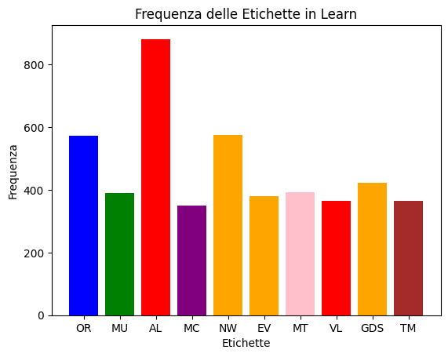
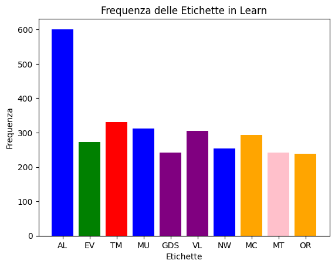

# VirgilML 🧠 | Last docs update: 2/1/2024 (d/m/y)

##  ❗ **DEPRECATED** ❗

The model is very ineffective and needs to be totally redone, but due to lack of data it will not be revived for a long time

## INDEX TOPICS 📖
  - [Introduction 📝](#introduction-)
  - [Important Notes 📋](#important-notes-)
  - [Model alternative ✅](#model-alternative-)
  - [Datas and Dataset 📅](#datas-and-dataset-)
  - [Vectorize 🔀](#vectorize-)
  - [Grid search 🧱](#grid-search-)
  - [Let's analyze the results 🏅](#lets-analyze-the-results-)
    - [Italian model 🟩⬜🟥](#italian-model-)
    - [English model :gb:](#english-model-gb)
  - [Conclusion 🔚](#conclusion-)
  - [Other](#other)
    - [Website](#website)
    - [Mobile APP](#mobile-app)
    - [VirgilAI](#virgilai)
  - [Credits](#credits)
    - [Contact me](#contact-me)

## Introduction 📝

I have created a model based on the SVC (Support Vector Classifier) Machine Learning algorithm in which the task is to understand the context of the sentence or command so that successively the various commands or other preliminary instructions can be executed

## Important Notes 📋

I am really young in this field, I have just approached and I have not studied (for now) this subject namely that of model and data analysis but based on what few (but enough for now) data and tests I have done I have tried various algorithms and datasets with various strategies but I am always open to advice and suggestions on the dataset and model.

## Model alternative ✅

Unlike the first model I created in this new version I wanted to focus in the SVC (Support Vector Classifier) machine learning model but with more alternatives and variables in between including in-depth GridSearch, Various types of Vectorization, Embedding etc....

## Datas and Dataset 📅

As for the dataset I started from the datasets of the old version of the datasets pero pure so without tokenization, removing stop words and other
After trying various combinations of data cleaning and processing, I arrived at this winning combination

- Data augmentation via synonyms and shuffle
- Irrelevant tip removal
- .lower() on all words
- duplicate removal

As for the Italian datasets:
Each class has about 350 to 600 sentences except for the AL (other) class where it was important to have so much data to differentiate the class

The English one on the other hand:
The data is much less this because of the more advanced vetorization model and the fact that the language is better optimized for the given model in fact here the data goes

The tool for tokenize and clear is in the directory script

## Vectorize 🔀

I have tried various types of vectorisation including the classic TFID up to something even a bit bigger or more complex

The ones I have tried are

- TFID
- Word2Vec with google data (I will explain later why I did not use this)
- Glove2Vec

Each one has its pros and cons but mainly my decision was to use TFID for the Italian model and Glove2Vec for the English one because TFID vectorised the Italian sentences efficiently and was the only one that didn't require data beforehand but was more or less global (but also losing a bit of performance). Instead for the English model I chose Glove and not Word because Word2Vec with the data I had was too heavy (3. 6gb) and this was causing major problems from the transfer of the model to the use of ram now virgilio with the English model weighs 470MB and the Italian one 200MB (I think it can be improved even more)... So in the end I chose to use the Glove model

## Grid search 🧱

For those who do not know what grid search is, grid search is a technique used to find the best parameters of a given model by trying various combinations until the best parameters are found Depending on the parameters and cores will depend on the speed of the grid search

In my case I did two grid searches both with 16 cores

The first concerning only the SVC model and TFID vectorisation
the second always concerning the SVC but combined with the Glove2Vec/Word2Vec vectorisation

In the first case, the combinations were about 57,000 and with 16 cores it took about 16 minutes. In the second case, the combinations were 876,000 (approx.) and again with 16 cores it took about 3.7 hours, but the results in both cases were efficient.

## Let's analyze the results 🏅

### Italian model 🟩⬜🟥

All the italian result is in the file result_it.txt but let's analyze them in detail

Best score:

  **--- Report Embed ---  [BEST]**
                   precision    recall  f1-score   support

          AL       0.84      0.98      0.90       146
          EV       0.97      0.94      0.95       181
         GDS       0.98      0.97      0.97        91
          MC       0.66      0.85      0.74        78
          MT       0.95      0.92      0.94       113
          MU       0.92      0.91      0.91        64
          NW       0.91      0.97      0.94        30
          OR       0.97      0.62      0.75        94
          TM       0.97      0.92      0.95        79
          VL       1.00      1.00      1.00        30

    accuracy                           0.90       906
    macro avg      0.92      0.91      0.91       906
    weighted avg   0.92      0.90      0.90       906

Worst score:

  **--- Report Word2Vec: ---**
  
                   precision    recall  f1-score   support

          AL       0.63      0.94      0.75       146
          EV       0.92      0.77      0.84       181
         GDS       0.93      0.96      0.94        91
          MC       0.75      0.95      0.84        78
          MT       0.80      0.64      0.71       113
          MU       0.86      0.58      0.69        64
          NW       0.52      0.97      0.67        30
          OR       0.81      0.45      0.58        94
          TM       0.97      0.91      0.94        79
          VL       1.00      1.00      1.00        30

    accuracy                           0.79       906
    macro avg       0.82      0.82     0.80       906
    weighted avg    0.82      0.79     0.79       906

In the Italian results the model with the best result is just the embed model that as I said several times exploits a kind of meeting point between two different models going then to choose the result together (a kind of collaboration between algorithms) instead because of the little compatibility with the Italian the word2vec model that uses English data and not Italian was the worst (I'm looking for a model compatible with the Italian)

Final ranking:

1) Model Embend
2) Model SVC standard
3) Pipeline SVC Word2Vec

### English model :gb:

Like the Italian model results there are also English test results that are even more numerous

Best score:

  **--- Report Word2Vec: --- [BEST]**
  
                   precision    recall  f1-score   support

          AL       0.94      1.00      0.97       146
          EV       0.96      0.99      0.98       178
         GDS       0.98      1.00      0.99        90
          MC       0.73      1.00      0.84        77
          MT       1.00      0.73      0.85        98
          MU       1.00      0.94      0.97        62
          NW       0.79      1.00      0.88        30
          OR       0.88      0.66      0.75        90
          TM       0.97      0.96      0.97        79
          VL       1.00      1.00      1.00        30

    accuracy                           0.93       880
    macro avg       0.92      0.93     0.92       880
    weighted avg    0.93      0.93     0.92       880

Worst score:

  **--- Report Forest ---**

                 precision    recall  f1-score   support

          AL       0.74      1.00      0.85       146
          EV       0.91      0.93      0.92       178
         GDS       0.94      0.92      0.93        90
          MC       0.67      0.83      0.74        77
          MT       0.82      0.43      0.56        98
          MU       0.97      0.94      0.95        62
          NW       0.56      1.00      0.71        30
          OR       0.79      0.54      0.64        90
          TM       1.00      0.78      0.88        79
          VL       1.00      1.00      1.00        30

    accuracy                            0.83       880
    macro avg       0.84      0.84      0.82       880
    weighted avg    0.85      0.83      0.82       880

As we can see the best result was achieved by google word2vec model instead the worst the random forest (I think I used it in the wrong way but that is not the problem) unlike the Italian one here word2vec is very very efficient because of its great compatibility and the enormity of data passed to the vectorization model

Final ranking:

1) Pipeline SVC Word2Vec
2) SVC standar
3) Pipeline SVC Glove2Vec
4) Model Embed
5) Forest Random Classifier

## Conclusion 🔚

In the end I managed to achieve my goal of getting models with accuracy score of 90% and also have a compromise with the weight of the models themselves in fact the Italian model weighs about 25MB and the English one 163MB (If I had used the Word2Vec model and not the Glove it would have weighed 3.6GB) to finish the analysis of the models and test the various parameters I faced a study of about a week not counting my first attempt with the old model of which I leave you the documentation [here](README_oldversion.md)...

There will probably be other developments as far as studying the models or testing other strategies so it can be called a kind of preversion of the models that have yet to be tested in the field and in the use of [VirgilioAI](https://github.com/Retr0100/VirgilAI)

## Other

As mentioned above, VirgililAI is part of a larger project that includes an app, a website and others, the links of which are at Project:

### [Website](https://projectvirgil.net)

### [Mobile APP](https://github.com/Retr0100/VirgilApp)

### [VirgilAI](https://github.com/Retr0100/VirgilAI)

## Credits

The project is made by one person and is still in development, I'm looking for someone to give me advice and a hand to continue the project, which I believe is an excellent open source and free alternative to devices like Alexa or Google Home.

### Contact me

For code related issues you can use github directly for other collaborations or alerts write to this email <projectvirgilai@gmail.com>

If you want to support a small developer take a [**special link**](https://www.paypal.me/Retr0jk)
